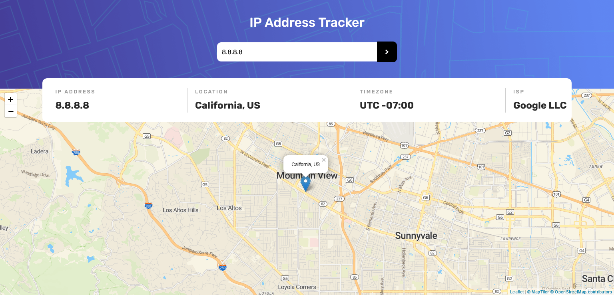

# IP address tracker 🗺 || Frontend Mentor

This is a solution to the [IP address tracker challenge on Frontend Mentor](https://www.frontendmentor.io/challenges/ip-address-tracker-I8-0yYAH0). Frontend Mentor challenges help you improve your coding skills by building realistic projects.

## Table of contents

- [Overview](#overview)
  - [The challenge](#the-challenge)
  - [Screenshot](#screenshot)
  - [Links](#links)
- [My process](#my-process)
  - [Built with](#built-with)
  - [What I learned](#what-i-learned)
  - [Useful resources](#useful-resources)
- [Author](#author)

## Overview

### The challenge

Users should be able to:

- View the optimal layout for each page depending on their device's screen size
- See hover states for all interactive elements on the page
- See their own IP address on the map on the initial page load
- Search for any IP addresses or domains and see the key information and location

### Screenshot

### Links

- Solution URL: [Add solution URL here](https://your-solution-url.com)
- Live Site URL: [Here](https://ip-address-tracker-lilac.vercel.app/)

## My process

### Built with

- Semantic HTML5 markup
- CSS custom properties
- Flexbox

### What I learned

- I learned how to use IP Geolocation API by [IPif](IPify.com) to get the location of the user's IP address or given address.
- How to use [Leaflet](https://leafletjs.com/) to create a map of the user's IP address or the given IP address.

### Useful resources

- [Leaflet Docs](https://leafletjs.com/SlavaUkraini/examples/quick-start/) - A quick start guide to Leaflet.
- [Leaflet Tutorial](https://www.youtube.com/watch?v=wVnimcQsuwk&ab_channel=MapTiler) - This helped understand how the map function works and how to use it to display the map.
- [Ipify Docs](https://geo.ipify.org/docs) - The IP Geolocation API docs were very helpful and easy to understand on how to get the IP address, location (latitude, longitude, region and country) and ISP (Internet Service Provider). I used teh API Type 2 to get all the information I need.

## Author

- Website - [Mohanad Alrwaihy](https://mohanad-portfolio.pages.dev/)
- Frontend Mentor - [@MohanadOO](https://www.frontendmentor.io/profile/MohanadOO)
